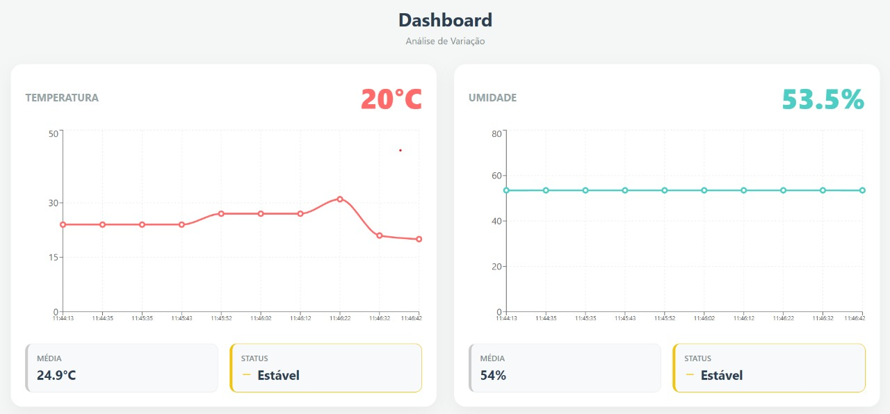
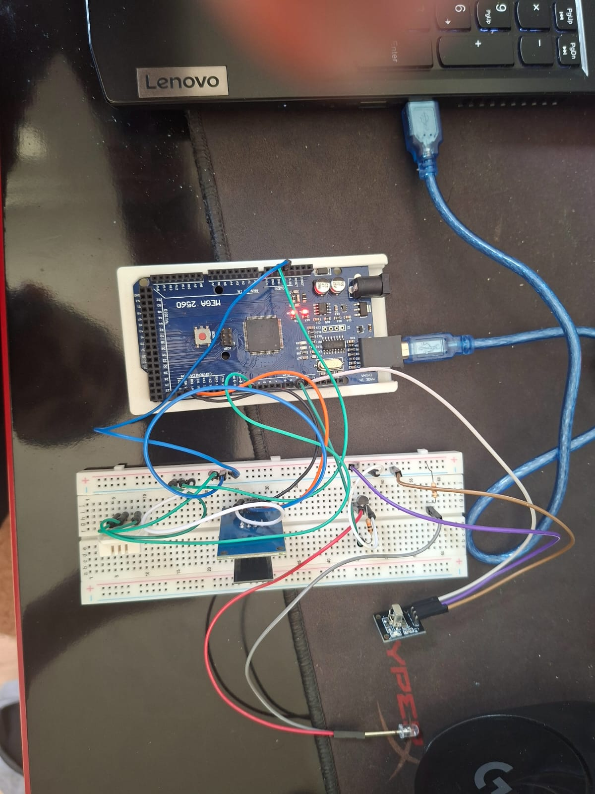

# Sistema de Climatização Inteligente via Wi-Fi, com Infravermelho

**Integrantes:**
* Lucas Eduardo Bernardes de Paula
* Messias Feres Curi Melo

## 1. Contextualização do Projeto
Este projeto consiste no desenvolvimento de uma central de automação residencial focada no monitoramento climático e controle de dispositivos via infravermelho (IR). O sistema utiliza um **Arduino Mega** como controlador central, integrando conectividade Wi-Fi para gerenciamento remoto e sensores para leitura ambiental.

O objetivo principal é criar um ecossistema capaz de ler a temperatura e umidade do ambiente e permitir o acionamento remoto de Ar-Condicionados através de uma interface. O projeto explora conceitos de IoT (Internet das Coisas), protocolos de comunicação Serial (UART), manipulação de sinais infravermelhos e servidores Web embarcados.

## 2. Dinâmica e Funcionalidades
O sistema opera executando três tarefas principais simultaneamente:

1. **Monitoramento Climático (DHT22):**
* O sensor lê constantemente a temperatura e a umidade do local.
* Esses dados são exibidos em tempo real na interface Web acessível pelo navegador.

2. **Interface Web e Conectividade (ESP-01):**
* O módulo ESP-01 atua como um servidor Web. Ele gera uma página HTML (estilo "App") que exibe os dados climáticos.

3. **Controle Infravermelho (IR):**
* **Modo de Aprendizado:** O sistema possui um receptor capaz de ler sinais de controles remotos convencionais para "clonar" suas funções.
* **Modo de Envio:** Através de um LED emissor IR, o Arduino replica os códigos salvos para controlar os aparelhos, substituindo o controle físico.

## 3. Lista de Materiais
| Material | Especificação | Quantidade |
| --- | --- | --- |
| **Microcontrolador** | Arduino Mega 2560 | 1 |
| **Módulo Wi-Fi** | ESP8266 (Modelo ESP-01) | 1 |
| **Sensor Climático** | DHT22 (AM2302) | 1 |
| **Receptor IR** | Módulo KY-022 | 1 |
| **Transistor Bipolar** | BC547  | 1 |
| **Emissor IR** | LED Infravermelho (5mm) | 1 |
| **Resistores** | 220Ω e 330Ω (p/ LED) | 2 |
| **Conexões** | Protoboard 400 furos + Jumpers | 1 |

## 4. Diagrama de Montagem
Abaixo está o esquema de ligação dos componentes desenvolvido no software Fritzing.

 

## 5. Detalhes da Montagem e Hardware
A escolha do **Arduino Mega 2560** foi estratégica para garantir o desempenho e a estabilidade do sistema, especialmente devido à necessidade de múltiplas portas Seriais de Hardware (HardwareSerial) e o uso de timers específicos exigidos pela biblioteca `IRremote`.

* **Arduino Mega 2560:** Atua como o cérebro do sistema, gerenciando a lógica de controle, leitura de sensores e comunicação com os periféricos. Sua capacidade de memória e número de portas digitais/analógicas facilitam a expansão futura do projeto.
* **ESP-01 (Wi-Fi):** Este módulo é responsável pela conectividade sem fio. Ele está conectado à porta `Serial1` do Arduino Mega (Pinos 18 TX e 19 RX). A utilização da `Serial1` (Hardware Serial) em vez da `SoftwareSerial` (usada no Uno) proporciona uma comunicação muito mais estável, rápida e confiável, essencial para o servidor web.

* **Sensor DHT22:** Conectado ao pino digital `D2`. Este sensor foi escolhido pela sua precisão superior na leitura de temperatura e umidade em comparação ao DHT11, garantindo dados mais confiáveis para o monitoramento ambiental.
* **Receptor IR (KY-022):** Conectado ao pino digital `D11`. Este componente é fundamental para a funcionalidade de "aprendizado" do sistema, permitindo capturar e decodificar os sinais infravermelhos emitidos pelos controles remotos originais dos aparelhos.
* **Emissor IR (LED):** Conectado **obrigatoriamente** ao pino digital `D9`.
* **Nota Técnica Importante:** No Arduino Mega, a biblioteca `IRremote` utiliza especificamente o **Timer 2** do microcontrolador para gerar a frequência portadora de 38kHz necessária para a transmissão do sinal infravermelho. Este timer está fisicamente atrelado ao pino 9, tornando essa conexão mandatória para o funcionamento correto do envio de comandos. Utilizar outro pino resultará na falha da emissão do sinal.

## 6. Interface do Usuário
A interface foi desenvolvida em React VITE, servida diretamente por conexão com o Firebase. Ela permite visualizar a temperatura.

---

## 7. Foto do Projeto Montado

## 8. Demonstração do Projeto (Vídeos)
 Também disponíveis na pasta vídeos 
<table style="width: 100%; text-align: center;"> 
<tr> <td>
<strong>Clonagem de IR</strong></td> 
<td><strong>Monitoramento de Temperatur </strong></td> 
</tr> <tr> 
<td> <video src="./Vídeos/clonar.mp4" width="350" controls> Seu navegador não suporta o elemento de vídeo. </video> </td> 
<td> <video src="./Vídeos/temperatura.mp4" width="350" controls> Seu navegador não suporta o elemento de vídeo. </video> </td> 
</tr> </table>

## 9. Diário de Bordo 
Abaixo, o registro cronológico das atividades desenvolvidas, organizado por semanas de trabalho:

### **Semana 1: 17/11 a 23/11 — Planejamento e Fundamentos**
**Foco:** Definição do escopo, testes de sensores e conectividade inicial.

* **Planejamento:** Definição do escopo do projeto (Automação de AC via Wi-Fi) e levantamento dos materiais necessários.
* **Sensores:** Estudo do datasheet do Arduino Mega e validação do sensor DHT22 (leitura de temperatura/umidade no Serial Monitor).
* **Conectividade (ESP-01):** Início dos testes com o módulo Wi-Fi. Configuração dos comandos AT.
* **Desafios:** Enfrentamos instabilidade na comunicação com o ESP-01, identificada como problemas na alimentação de 3.3V, exigindo ajustes no circuito.

### **Semana 2: 24/11 a 30/11 — Interface Web e Infravermelho Básico**
**Foco:** Criação do servidor e testes com protocolos simples (TV).

* **Servidor Web:** Desenvolvimento do código HTML embarcado no Arduino. Implementação bem-sucedida da comunicação via `Serial1` (Hardware Serial) do Mega, permitindo acesso ao IP pelo navegador do celular.
* **Infravermelho (Recepção):** Instalação da biblioteca `IRremote` (v4.x) e montagem do receptor KY-022.
* **Sucesso Inicial:** Conseguimos ler, decodificar e replicar códigos de um controle remoto de TV Samsung (Protocolo NEC), validando a lógica de clonagem para sinais curtos.

### **Semana 3: 01/12 a 07/12 — Integração e Estruturação do Código**
**Foco:** Unificação dos módulos e preparação para o Ar-Condicionado.

* **Integração de Sistemas:** Fusão dos códigos do Servidor Web com a lógica de Infravermelho.
* **Refinamento do Hardware:** Organização dos componentes na protoboard para melhorar a estabilidade das conexões.
* **Testes de Envio:** Ajustes no circuito do emissor IR (LED) e testes de alcance com a TV, preparando o terreno para o controle do Ar-Condicionado na semana seguinte.

### **Semana 4: 08/12 a 14/12 — O Desafio do AC e Finalização**
**Foco:** Protocolos complexos, debugging e documentação final.

* **O Problema do AC:** Tentativa de clonar o controle do Ar-Condicionado (Split). O sinal era identificado como `UNKNOWN` ou gerava `OVERFLOW`.
* **Análise Técnica:** Descobrimos que o pacote de dados de um AC é muito maior que o de uma TV, enviando o estado completo (Temperatura, Modo, Fan, Checksum) em um único pulso, o que estourava o buffer padrão da biblioteca.
* **Tentativas de Solução:** Realizamos o aumento do buffer de leitura, análise dos códigos binários "RAW" e troca de resistores para aumentar a potência do LED emissor.
* **Entrega:** Refinamento final da interface Web, montagem final do protótipo para apresentação e redação da documentação técnica relatando as limitações encontradas com o protocolo proprietário do AC.

## 10. Problemas Encontrados e Soluções
Durante o desenvolvimento, o projeto enfrentou desafios técnicos relacionados à eletrônica e ao processamento de sinais. Abaixo, detalhamos os quatro principais obstáculos.

### 1. Complexidade e Tamanho dos Sinais de Ar-Condicionado
Diferente de TVs, que enviam códigos curtos e simples (ex: 32 bits), os controles de ar-condicionado enviam o "estado completo" do aparelho a cada comando, gerando sequências de dados muito longas.

* **O Problema:** A biblioteca de infravermelho frequentemente falhava ao capturar o sinal, interpretando-o como `UNKNOWN`, ou travava o microcontrolador devido ao estouro de memória (buffer overflow).
* **A Causa:** O buffer padrão de recepção não era suficiente para armazenar as centenas de pulsos "RAW" (brutos) necessários para representar um único comando complexo de ar-condicionado.
* **Solução/Desfecho:** Foi necessário aumentar manualmente o tamanho do buffer de recepção (`RAW_BUFFER_LENGTH`) nas configurações da biblioteca e otimizar o código para lidar apenas com arrays de dados brutos, abandonando a tentativa de decodificação hexadecimal para estes aparelhos.

### 2. Instabilidade na Alimentação e Limitações do Hardware
Durante a integração do módulo Wi-Fi ESP-01, o sistema apresentava comportamento errático e falhas de comunicação.

* **O Problema:** O módulo sofria reinicializações aleatórias e desconexões frequentes da rede ao tentar enviar dados, comprometendo a comunicação com o servidor.
* **A Causa:** Identificou-se que o regulador de tensão de 3.3V do **Arduino Uno** não conseguia fornecer a corrente estável necessária para suportar os picos de consumo do ESP-01 durante a transmissão Wi-Fi.
* **Solução/Desfecho:** A solução adotada foi a substituição do microcontrolador: trocou-se o Arduino Uno pelo **Arduino Mega 2560**. O Mega ofereceu maior robustez na alimentação e capacidade de processamento, eliminando as quedas de tensão críticas e estabilizando a conexão do módulo Wi-Fi.

### 3. Conflito de Timers no Hardware (PWM)
Inicialmente, o emissor infravermelho (LED IR) não funcionava, embora o código compilasse sem erros.

* **O Problema:** O LED piscava, mas o sinal não era modulado na frequência correta (38kHz), tornando-o invisível para os receptores dos aparelhos.
* **A Causa:** Restrição de hardware da biblioteca `IRremote`. No Arduino Mega, a modulação de sinal infravermelho é atrelada a timers específicos que obrigam o uso do **Pino 9**. O uso de outros pinos PWM não gera a onda portadora correta.
* **Solução/Desfecho:** A leitura aprofundada da documentação permitiu identificar a restrição e realizar a troca física da conexão para o pino mandatório, resolvendo a emissão do sinal.

### 4. Inviabilidade de Comunicação com Equipamento Elgin
Apesar do sucesso com TVs e receptores de mídia, a integração específica com o ar-condicionado da marca Elgin não foi concluída.

* **O Problema:** O aparelho Elgin ignorava sistematicamente os comandos replicados pelo Arduino, mesmo quando estes pareciam idênticos aos originais sob análise lógica.
* **A Causa:** O protocolo proprietário da Elgin não possui documentação pública e demonstrou uma sensibilidade extrema a variações de microssegundos (*timing jitter*). As pequenas imprecisões temporais naturais da execução do código no Arduino foram suficientes para que o receptor do ar-condicionado rejeitasse o sinal como ruído.
* **Solução/Desfecho:** Em razão das **sucessivas tentativas sem sucesso** na replicação do sinal e da instabilidade persistente na comunicação, a funcionalidade de controle remoto para este modelo de ar-condicionado foi **abandonada** no escopo final do projeto.

## 11. Referências
* **Medição de Temperatura:** [Arduino and DHT22 Temperature Measurement](https://www.instructables.com/Arduino-and-DHT22-AM2302-Temperature-Measurement/)
* **Conectividade Wi-Fi:** [Conectando o Arduino à internet com ESP-01](https://curtocircuito.com.br/blog/IoT/conectando-o-arduino-a-internet-com-esp01)
* **Infravermelho:** [Guia Completo do Controle Remoto IR](https://blog.eletrogate.com/guia-completo-do-controle-remoto-ir-receptor-ir-para-arduino/)
* **Biblioteca Utilizada:** [IRremote by ArminJo](https://github.com/Arduino-IRremote/Arduino-IRremote)
